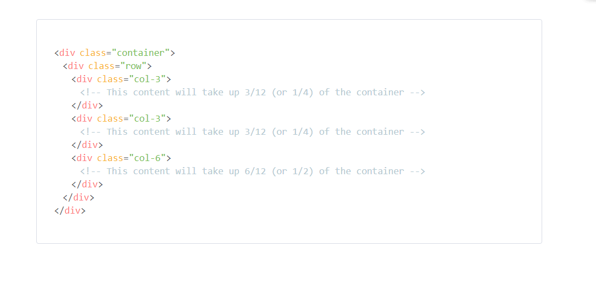
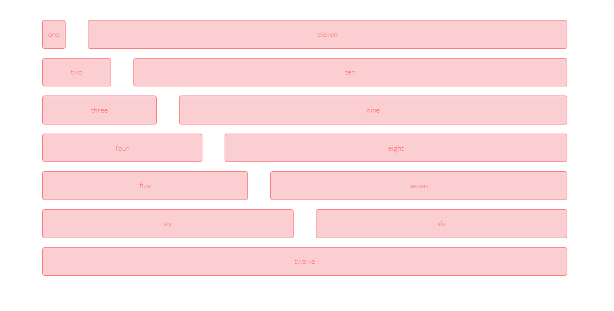

# CSS FRAMEWORK GUIDE

The main object is to build a custom made framework using sass 

## Technologies
 * CUSTOM FRAMEWORK
 * HTML5
 * JAVASCRIPT
 * CSS
 * SASS
 

## Grid
Each column is contained within rows, which are contained within a container. The container is set to a maximum width of 960px, but you can edit without having to break anything.

## Screenshot

 

## Code
Simply state the number of columns you want your content to occupy in the .col class. For example, if you want your content to take up 8 columns (out of 12), simply give your content the class .col-8.

Simple grid is built mobile-first, so all columns will expand to the full container width on smaller screens. If you don’t want columns to expand on mobile devices and small screens, simply add -sm to the end of your column class name. For example, if you want to have two blocks of content floating side-by-side on small screens, each would be given the class name .col-6-sm.

Be sure to nest columns within a .row class. You may also choose to nest rows within a .container class.
 

## Screenshot

 

Offset classes
Move columns to the right using .offset-*-md classes. These classes increase the left margin of a column by * columns. For example, .offset-4-md moves .col-4-md over four columns.
 
Typography
Simple Grid uses Lato from Google Fonts as a base font-family. Font-size is based on root rem units.

# Header 1
## Header 2
### Header 3
#### Header 4
##### Header 5
###### Header 6

Additionally, should you choose to style any of the headers or paragraph font-weights, simply add the class .light-font, .regular-font, or .heavy-font to your markup. Paragraph text is set by default to a font-weight of 200. Note: the .font-heavy class should not be used as a replacement for semantic bold body copy. 
## Authors

👤 **Adama Chubiyojo Desmond**

-  [Github](https://github.com/kobiyoyo)
-  [Twitter](https://twitter.com/_kobiyoyo)
-  [Linkedin](https://www.linkedin.com/in/chubiyojo-adama/)
-  [Email](mailto:adamachubi@gmail.com)

👤 **Danilo Zagarcanin**

- [Github](https://github.com/danilozag1992)
- [Twitter](https://twitter.com/danilo96061514)
- [Linkedin](https://www.linkedin.com/in/danilo-zagarcanin-88169b185/)
- [Email](mailto:danilozagarcanin@gmail.com)

## 🤝 Contributing

Contributions, issues and feature requests are welcome!

Feel free to check the [issues page](issues/).

## Show your support

Give a ⭐️ if you like this project!

## Acknowledgments

- Hat tip to anyone whose code was used
- Inspiration
- etc

## 📝 License

This project is [MIT](lic.url) licensed.

